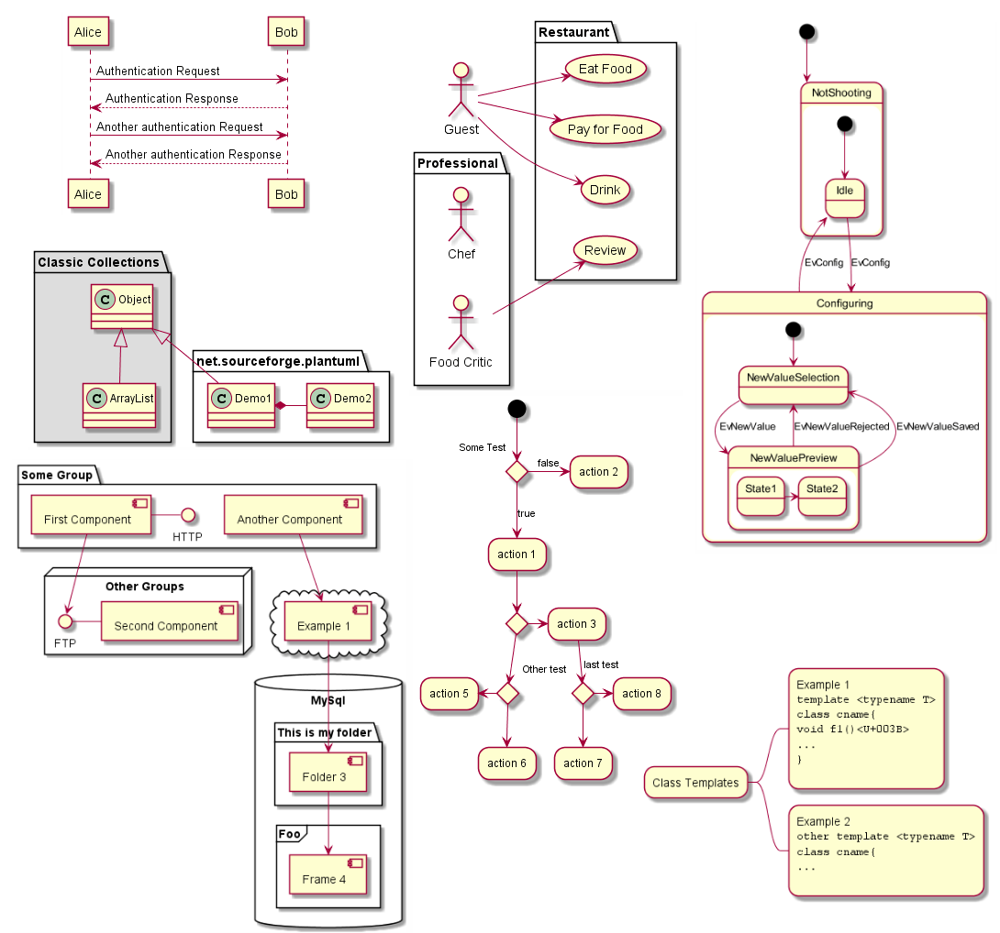

# PlantUML

Author: Brian Dillon

PlantUML is about 260 KSLOC of java code that reads in well-formatted configuration
files and outputs png image files. It was used by Jeff McAteer in the example program
<a href="https://github.com/bsdillon/DahlgrenTest/blob/master/model_code/datasets/simple_target_broadcast.csv">Link</a>.
PlantUML is still under development with several different types of diagrams available.
Some of the diagrams require GraphViz (see <a href="https://plantuml.com/graphviz-dot">these instructions</a>).

The input data is variably formatted but there are a number of instructional pages and a full <a href="http://plantuml.com/guide">PDF of documentation</a>.

The tool can be tested at <a href="http://www.plantuml.com/plantuml/uml/SyfFKj2rKt3CoKnELR1Io4ZDoSa70000">the online server</a>.

## Dependencies

 - [java](https://jdk.java.net/15/)
 - [GraphViz](https://www2.graphviz.org/Packages/stable/windows/10/msbuild/Release/Win32/)
