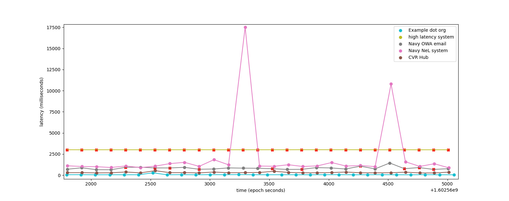

# Sys-Stat

`sys-stat.exe` reads a configuration file
describing services which the local machine is expected to
have access to. It defaults to the file `sys-stat.toml` in
the current working directory; if nonexistent it tries
to find a file named `.sys-stat.toml` in your home directory.
(commonly `C:\\Users\\User Name\\` on windows and '/home/user-name/' on \*nix systems.)

# Build Process

`sys-stat` uses [`cargo`](https://doc.rust-lang.org/book/ch01-03-hello-cargo.html)
to build [rust](https://www.rust-lang.org/) code,
which may be installed from https://rustup.rs/ .

By default `build.py` builds a release for the host OS,
if running from a linux host it will try to cross-compile
for 64-bit windows. See [this wiki article](https://wiki.archlinux.org/index.php/Rust#Cross_compiling)
for details setting up a cross-compilation environment if you are interested in building windows
`.exe` files using a linux host.

To build a debug binary:

```bash
cargo build
# outputs target/debug/sys-stat[.exe]
```

To build a release binary:

```bash
cargo build --release
# outputs target/release/sys-stat[.exe]
```

To quickly run in debug mode:

```bash
cargo run
```

# Data Visualization

Run `python chart.py [/path/to/log.csv]` to display
a matplotlib chart of tested systems, like this:



The X axis is time in Epoch seconds, the Y axis is latency in milliseconds,
and an `X` on the line represents a point when the system was determined to
be down (either due to a closed connection, a timeout, or a response not having required content).

# Source overview

`src/main.rs` is the program's entry point,
`src/config.rs` defines a structure for the config file,
and `src/check.rs` implements a check routine for a single service
defined in the config file.

To add a new source file create it under the `src/` directory
and include it in the program by adding `mod file_name;` in `src/main.rs`.
You can read about [Rust's module system here](https://doc.rust-lang.org/rust-by-example/mod.html).


# Configuration file

see `sys-stat.toml` for an example config file.

The `[general]` section holds actions taken when
systems are offline and lets you set the log_file
where system statistics are written.

Each `[[sys]]` section describes a system which
will be tested periodically. At the moment only
`http://` and `https://` URLs are supported but the
long-term plan is to support many other protocols (`mysql://`, 'ftp://', etc.)

## Example Config

```toml

# Example config file

[general]
log_file = "/tmp/status.csv"

[[sys]]
name = "Example dot org"
uri = "http://example.org/"
description = """
  This system responds to http GET requests with a 200 and a document
  containing the phrase "This domain is for use in illustrative examples in documents".
"""
# If the response does not contain this the status becomes "bad"
response_must_contain = "This domain is for use in illustrative examples in documents"
# If the server does not finish replying within this amount of time the status becomes "bad"
response_must_finish_within = "30s"

check_interval = "5m"


[[sys]]
name = "high latency system"
uri = "http://slowwly.robertomurray.co.uk/delay/8000/url/http://example.org"
response_must_finish_within = "3s"
check_interval = "30s"

```

# Future Ideas

 - [ ] Actually execute the commands in `general.on_status_change`
 - [ ] Make SSL certificates expiring in the next 2 weeks a failure case
    - This affects `https://` endpoints and gives teams warning before a certificate expires
 - [ ] Add support for `postgresql://` URLS using [this library](https://docs.rs/postgres/0.17.5/postgres/)
    - This would let us test databases and report latency/downtime
 - [ ] Execute commands in `on_status_change`, `on_status_good`, and `on_status_bad` in `[general]`
 - [ ] Add an email report config section;
    - given an email account and a new field `report_to` in each `[[sys]]` block
      send emails when system downtime is detected.


